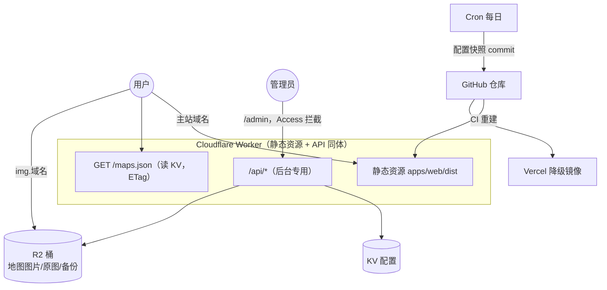

# 后台管理系统设计（Phase 2，待实施）

> 2026-07-14/15 逐项确认的设计定稿。目标：网页后台管理地图资源与配置，改动**秒级生效**，不依赖本地脚本与 git 操作。
> 前置阅读：[ARCHITECTURE.md](ARCHITECTURE.md)（当前静态架构）。

## 1. 路线决策记录

### 1.1 已确认的需求范围

- **全量 CRUD**：新增地图、改名/方向/备注、换图、拖拽排序、草稿/发布、删除（回收站）。
- **裁剪工作台**：上传一张原图（素材通常为 1280×720 横版：左半 1 楼 / 右半 2 楼 / 白框入口小图）→ 框选区域 → 浏览器内自动切出各张 WebP。
- **登录方式**：Cloudflare Access，邮箱验证码（One-time PIN）与 GitHub OAuth 两种同时开。
- **域名**：用户已有自定义域名，托管到 Cloudflare（具体域名与子域分配见 §12 待定项）。

### 1.2 路线选择：B「全动态」（已确认）

| | 路线 A：Git 为数据源，后台=编辑器 | **路线 B：全动态（已选）** |
|---|---|---|
| 数据存放 | 仓库文件，后台经 GitHub API 提交 | 配置存 KV，图片存 R2 |
| 生效时间 | 1–3 分钟（等 CI 构建） | **秒级，无需部署** |
| 版本历史 | git 天然自带 | 需自建备份机制（§8） |
| Vercel 镜像 | 完整独立 | 降级为静态壳，需快照回写补偿（§8） |

选 B 的代价通过三项补偿设计收回：保存留档可恢复、每日快照回写 git、前端内嵌兜底数据（§8、§9）。

## 2. 总体架构



域名规划（占位，正式域名待定）：

| 主机 | 用途 | 缓存 |
|------|------|------|
| `map.<domain>`（或根域） | 静态站 + `/maps.json` + `/admin` + `/api/*` | 见 §5 |
| `img.<domain>` | R2 桶自定义域直出图片，**不经 Worker、不耗调用配额** | 一年 immutable |

「同源」要求落在 `/maps.json` 上（严格同源）；图片跨子域对 `` 无影响。

## 3. 数据模型（KV）

KV 键 `config:current`，单文档：

```jsonc
{
  "version": 17,                       // 每次保存 +1，乐观锁 & ETag 依据
  "updatedAt": "2026-07-15T12:00:00Z", // 保存时自动写入，页脚展示
  "maps": [
    {
      "id": 1,                         // 沿用现有数字主键，稳定不复用（新增取 max+1）
      "sort": 10,                      // 拖拽排序，间隔取值便于插入
      "direction": "左",
      "name": "左-Y门",                // 逻辑名（不带后缀）
      "displayName": "左-Y门",         // 展示名（「（新）」等后缀只写这里）
      "remarks": "左侧入口，呈现Y字形墙体结构",
      "published": true,               // 草稿/发布；草稿不出现在 GET /maps.json
      "deletedAt": null,               // 软删除时间戳（回收站，30 天后可清理）
      "images": {                      // 显式存完整 URL（含内容哈希文件名）
        "entry":      "https://img.<domain>/maps/entry/8f3a21c9.webp",
        "entryThumb": "https://img.<domain>/maps/entry-thumb/1d0c77ab.webp",
        "floor1":     "…", "floor2": "…", "full": "…"
      },
      "sourceKey": "sources/1-20260715.png"   // R2 内原图留档，供重新裁剪
    }
  ]
}
```

与现 `src/data/maps.json` 的迁移映射：`id`/`direction`/`name`/`displayName`/`remarks` 原样沿用；新增 `sort`（按现数组顺序 ×10 初始化）、`published: true`、`images`（迁移脚本上传图片后回填）、`version`。（「快速区域指引」的 `rooms` 字段已随功能移除，模型中不保留。）

## 4. 图片管线

**上传流程**（全部处理在浏览器完成，服务端零图像计算）：

```
后台上传原图 → Canvas 裁剪工作台（预置三个可调框：左半=1楼 / 右半=2楼 / 入口小图）
  → 浏览器导出 WebP q90：entry / floor1 / floor2 / full + entry-thumb（300px 宽）
  → POST /api/images → Worker 计算 SHA-256 取前 8 位作文件名
  → R2 put（Cache-Control: public, max-age=31536000, immutable）
  → 原图存 R2 sources/ 留档 → 返回 URL 集，保存时写入 KV
```

- **缓存穿透原理不变**：换图 = 新哈希 = 新 URL，用户刷新拿到新 `/maps.json` 后只重新下载变化的图；未变的图 URL 不变，继续命中一年缓存。哈希由 Worker 自动计算，无任何人工版本号环节。
- **R2 键名规范**：`maps/<kind>/<hash8>.webp`（纯 ASCII，延续现产物命名思路）；原图 `sources/<mapId>-<yyyymmdd>.<ext>`；备份 `backups/<ISO时刻>-v<version>.json`。
- **被替代的现有环节**：`crop_images.py`（本地裁图）与 `scripts/gen-thumbs.mjs`（sharp 缩略图）在图片迁入 R2 后退役——缩略图改为上传时浏览器一并生成。
- **PWA 适配**：runtimeCaching 按路径特征匹配（`/maps/<kind>/<hash>.webp`），与主机名无关，img 子域上线无需再改；前台 SW 的 navigateFallback 需将 `/admin`、`/api`、`/r2` 加入黑名单。
- **实现补充（2026-07-16）**：全图不单独裁剪，由 1楼+2楼 裁剪框纵向自动合成（与现有 full/ 构图一致）；**img 子域绑定前的过渡出图路径为同 Worker `GET /r2/<key>`**（`IMG_BASE_URL` var 控制前缀，默认 `/r2`，绑定子域后改 var 即可，仅影响新上传 URL，存量 URL 需脚本批量改写）。

## 5. API 设计

| 端点 | 鉴权 | 说明 |
|------|------|------|
| `GET /maps.json` | 公开 | 只返回 `published && !deletedAt`，按 `sort` 排序；`ETag: "v<version>"` + `Cache-Control: no-cache`，未变返回 304 |
| `GET /api/maps` | Access | 完整配置（含草稿与回收站） |
| `PUT /api/maps` | Access | 保存整份配置；请求带 `baseVersion`，与 KV 当前 `version` 不符返回 **409**（乐观锁，防多标签页互相覆盖）；保存前先把旧版本写入 R2 `backups/` |
| `POST /api/images` | Access | multipart 上传（各裁剪产物 + 可选原图），返回哈希 URL 集与 `sourceKey` |
| `GET /api/backups` | Access | 备份列表（时间 + 版本号） |
| `POST /api/restore` | Access | 恢复指定备份（当前版本先自动留档再覆盖） |

约定：`/api/*` 返回 JSON 错误体 `{ error, detail }`；写操作成功后返回新 `version`。

## 6. 鉴权与安全

- **Cloudflare Access** 应用覆盖 `/admin*` 与 `/api/*`：策略为邮箱白名单，身份源同时挂 One-time PIN 与 GitHub OAuth（免费 50 席位内）。
- **Worker 内二次校验**：验证 `Cf-Access-Jwt-Assertion`（对 team 域公钥 + AUD 校验），防止绕过边缘直接打 Worker。
- 前台（用户侧）没有任何写入通道；R2 桶不开公共写权限，仅 Worker 绑定可写。
- Cron 回写 git 用 GitHub fine-grained PAT，权限仅限本仓库 `contents: write`，存 Worker Secret。

## 7. 环境与部署配置

`wrangler.jsonc` 演进（在现有 assets 配置上追加）：

```jsonc
{
  "name": "idv-cryptic-map",
  "compatibility_date": "2026-07-01",
  "main": "workers/index.ts",                    // 新增：API + /maps.json + cron
  "assets": {
    "directory": "./apps/web/dist",
    "not_found_handling": "single-page-application",
    "run_worker_first": ["/maps.json", "/api/*"] // 这两类路径进 Worker，其余静态直出
  },
  "kv_namespaces": [{ "binding": "CONFIG", "id": "<prod>" }],
  "r2_buckets":    [{ "binding": "MEDIA",  "bucket_name": "idv-media" }],
  "triggers": { "crons": ["0 4 * * *"] },        // 每日快照回写
  "env": { "dev": { /* 独立 KV namespace + R2 桶，后台测试不碰生产数据 */ } }
}
```

后台界面为 `apps/admin`（pnpm workspace 早已预留），同 Vue 3 栈 + 成熟组件库（Naive UI / Element Plus），构建产物挂到 `/admin` 路径下随同一 Worker 部署。

## 8. 备份与降级（路线 B 的三项补偿）

1. **保存即留档**：每次 `PUT /api/maps` 前，旧配置写入 R2 `backups/`（保留最近 50 份），后台「版本历史」页一键恢复。
2. **每日快照回写 git**：Cron 读 KV 配置，内容有变化时经 GitHub API 提交到 `apps/web/src/data/maps.snapshot.json` → 触发 CI 重建 → **Vercel 镜像与前端内嵌兜底数据滞后 ≤ 1 天**。
3. **可随时退回纯静态**：出问题时从 wrangler 配置摘掉 `main`（或 `run_worker_first`），Worker 退回纯静态托管；前端 fetch `/maps.json` 失败自动回退内嵌快照（§9），站点照常可用。

## 9. 前端切换点（组件零改动）

唯一改动收在数据访问层 `src/data/maps.ts`（重构时预留的隔离点）：

```ts
// 现在：import maps.json + import.meta.glob 构建期解析
// Phase 2：
export async function loadMaps(): Promise<MapItem[]> {
  try {
    const res = await fetch('/maps.json');
    if (res.ok) return normalize(await res.json());   // 图片 URL 由数据下发，不再 glob
  } catch { /* 离线 / Worker 摘除 / file:// */ }
  return normalize(snapshot);                          // 内嵌每日快照兜底
}
```

配套调整：应用入口改为异步初始化（顶层 await / Suspense）；构建时仍向 `dist/` 输出一份静态 `maps.json` 快照，作为 Worker 未接管时该 URL 的服务文件（回退路径闭环）。

## 10. 免费额度评估（1500 日活）

| 资源 | 日消耗估算 | 免费额度 | 结论 |
|------|-----------|---------|------|
| Worker 调用（`/maps.json` + 后台 API；静态资源与 R2 直出不计） | ~2 000–5 000 | 10 万/天 | 宽裕 |
| KV 读 / 写 | 同上 / 个位数 | 10 万 / 1 000 每天 | 宽裕 |
| R2 存储（112 图 ~13MB + 原图留档 + 备份） | < 500MB（含 `maps/` 全量源图也 < 1GB） | 10GB | 宽裕 |
| R2 B 类读（边缘缓存未命中才计） | 数千 | 1 000 万/月 | 宽裕 |

**结论：全程 0 元，唯一成本是域名。**

## 11. 实施子阶段

| 阶段 | 内容 | 验收要点 | 状态（2026-07-16） |
|------|------|---------|------|
| 2.0 资源开通 | 域名 zone 接入、Worker 绑定自定义域、`img.` 子域绑 R2、Access 应用（双 IdP + 白名单）、KV/R2 各建 dev+prod（**Location Hint 选亚太**，回源跨境延迟最低）、Secrets（CF/GitHub PAT）、真实绑定 id 填入 wrangler.jsonc | Access 拦截 `/admin` 生效；img 子域可访问测试对象 | ⬜ 待用户操作 |
| 2.1 读路径 + 数据迁移 | Worker `main`（`GET /maps.json` 读 KV）；迁移脚本 `scripts/migrate-phase2.mjs`（图哈希命名上传 R2 + 灌 KV，`--local/--remote` 幂等可重跑）；前端 `initMaps()` + 内嵌兜底；PWA 适配 | 线上数据来自 KV；本地摘掉 Worker 验证回退；改一条 remarks 保存后普通刷新即见效、图片全命中缓存 | ✅ 代码完成，本地验证通过（feat/admin-backend） |
| 2.2 后台上线 | `apps/admin`（构建到 `dist/admin`，同 Worker 部署）：列表（筛选/拖拽排序/发布开关/回收站）、编辑 + 裁剪工作台、版本历史；`/api/*` 全套 + Access JWT 校验（Worker 内二次验签，dev 可关） | 手机端完整走一遍：新增草稿 → 裁图上传 → 发布 → 换图 → 恢复历史版本 | ✅ 代码完成，待 2.0 后线上联调 |
| 2.3 韧性收尾 | 保存留档（R2 backups/ 保留 50 份）、Cron 快照回写（每日 04:00 UTC，未配 secrets 自动跳过）、Vercel 镜像验证、恢复演练一次 | git 里出现快照提交；Vercel 镜像展示快照数据；演练「误删地图 → 后台恢复」 | 🟡 代码完成（快照文件接入打包兜底的接线待做）；验收待 2.0 |

回滚原则同 §8.3：任何阶段出问题，摘 Worker 路由即回到当前纯静态架构。

## 12. 待定决策

| # | 事项 | 默认建议 |
|---|------|---------|
| 1 | 主站用根域还是 `map.` 子域；图片子域名 | 图片默认 `img.`；主站看域名用途（正式域名确定后填入本文档占位处） |
| 2 | 入口小图裁剪框比例 | 现有 28 张 entry 图实测均 ≈1:1（1.00–1.03），**默认锁定 1:1、可手动解锁**，保证目录卡片整齐 |
| 3 | `maps/` 历史原始素材（~79MB，含 48MB 一图流）是否批量入 R2 `sources/` | **建议入**：此后重新裁剪全程网页操作；额度占用 < 1GB 无压力 |
