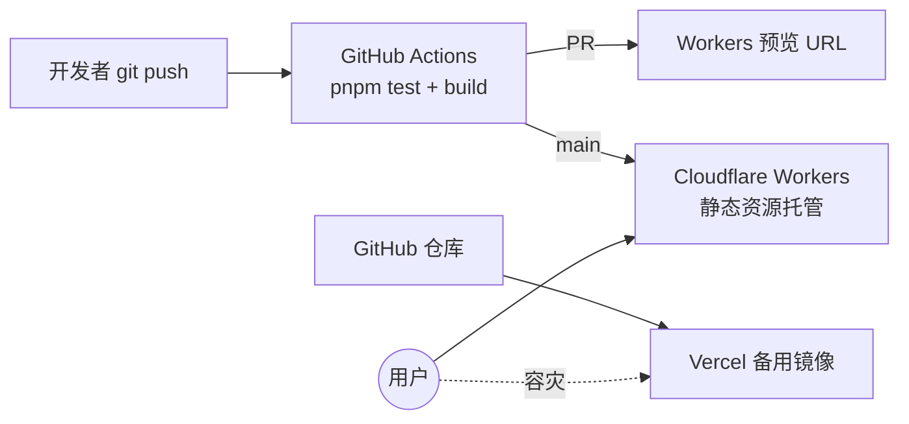
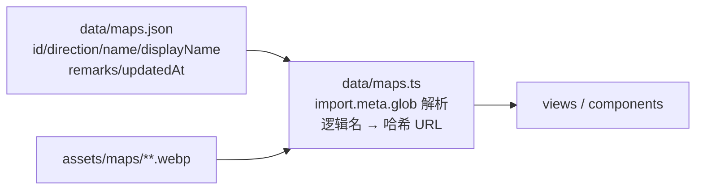

# 架构总览（当前实现）

> 对应 `refactor/vite` 分支（重构 Phase 0–7 已完成）。重构过程与验收记录见 [REFACTOR.md](REFACTOR.md)；下一阶段后台管理设计见 [ADMIN-BACKEND.md](ADMIN-BACKEND.md)。

## 1. 技术栈与部署拓扑

| 层 | 选型 |
|----|------|
| 构建 | Vite 7（内容哈希产物 + `assetFileNames` 纯 hash 命名） |
| 前端 | Vue 3（Composition API + `<script setup>`）+ TypeScript + vue-router（hash 模式） |
| 包管理 | pnpm workspace（`apps/*`，为 `apps/admin` 预留） |
| 离线 | vite-plugin-pwa（autoUpdate） |
| 测试 | Vitest 单测 + Playwright 驱动的 E2E/PWA 验收脚本 |
| 部署 | **Cloudflare Workers 静态资源托管**（主力）+ Vercel（备用镜像） |
| CI | GitHub Actions：PR → 测试/构建/上传预览版本；push main → `wrangler deploy` |



## 2. 目录结构（要点）

```text
idv-cryptic-map/
├── apps/web/                  # 前端应用
│   ├── scripts/               # gen-thumbs（sharp 缩略图）/ subset-fonts（字体子集化）
│   │                          # verify-e2e（31 项验收）/ verify-pwa（离线 5 项）
│   ├── public/                # _headers（缓存头）、PWA 图标、图例 icons
│   └── src/
│       ├── data/maps.json     # ★ 唯一数据源（地图元数据 + updatedAt）
│       ├── data/maps.ts       # 数据访问层（未来切 API 的唯一隔离点）
│       ├── assets/maps/       # entry / entry-thumb(生成) / floor1 / floor2 / full，28×4 webp
│       ├── assets/fonts/      # 子集化 woff2 ×3（共约 529KB）
│       ├── views/ components/ composables/（useZoomPan 缩放拖拽核心）
│       └── router.ts          # 与旧站 hash 链接逐字符兼容
├── maps/                      # 原始素材（含 48MB 一图流源图，不参与部署）
├── crop_images.py             # 裁图脚本（输出到 apps/web/src/assets/maps/）
├── wrangler.jsonc             # Workers 静态资源配置（SPA fallback）
├── vercel.json                # Vercel 镜像构建与缓存头
└── .github/workflows/deploy.yml
```

`site/` 旧站目录保留至生产切换验证通过后删除（见 OPERATIONS「上线待办」）。

## 3. 数据流：单一数据源



- **逻辑名约定**：`name` = 各目录下图片文件名（不带扩展名）；展示名（含「（新）」后缀）只写 `displayName`，改展示名不影响任何文件路径。
- **缺图即失败**：`maps.ts` 解析不到图片直接 throw，配合 Vitest 数据一致性测试，缺图/坏数据在 CI 就红，不会上线后 404。
- **只打包被引用的资源**：`import.meta.glob` 让淘汰图片从源头不进产物。

> 历史注记：重构初版曾实现「快速区域指引」（`rooms` 房间坐标 + 高亮聚焦），2026-07-16 经确认无实际使用价值已整体移除（`bf89f7a`），后续后台管理数据模型中也不保留该字段。

## 4. 缓存模型：「更新即生效」

| 资源 | Cache-Control | 说明 |
|------|---------------|------|
| `/`、`/index.html` | `no-cache, must-revalidate` | 体积几 KB，每次回源验证（ETag 304） |
| `sw.js` / `registerSW.js` / `manifest.webmanifest` | `no-cache, must-revalidate` | 保证 SW 及时更新 |
| `/assets/*`（JS/CSS/图片/字体） | `public, max-age=31536000, immutable` | 全部内容哈希命名，内容变 = 文件名变 |

原理：改图/改配置 → push → CI 构建（产物哈希变化）→ 部署 → 用户普通刷新时 HTML 回源拿到新哈希引用 → 只下载变化的文件，其余全部命中本地一年缓存。**无手动版本号，无需用户强刷。**

产物命名细节：统一纯 hash（源文件保持中文名，规避非 ASCII URL 兼容坑）；入口缩略图加 `t-` 前缀便于 PWA 按名 precache；`assetsInlineLimit: 0` 保证缓存粒度按文件独立。

## 5. PWA 策略

- `registerType: 'autoUpdate'`：后台发现新版自动激活，与「更新即生效」一致。
- precache 只放「壳子」（HTML/JS/CSS/字体/图标/入口缩略图）；约 13MB 的楼层/全图大图走 runtime CacheFirst（访问过才缓存），首访不强制全量下载。
- 逃生舱：SW 出严重问题时用 vite-plugin-pwa 的 `selfDestroying` 发一版自毁 SW，立即退回纯在线模式。

## 6. 字体

三款字体（Cinzel / Ma Shan Zheng / Noto Serif SC）子集化后自托管，无 Google Fonts 依赖（大陆可达）。子集字符表须覆盖 maps.json 全部文本——有单测守护，新增地图名出现缺字时 CI 会红，重跑 `scripts/subset-fonts.mjs` 即可。

## 7. 路由兼容（硬约束）

与旧站 hash 格式逐字符兼容，已分享链接永不失效：

| 格式 | 含义 |
|------|------|
| `#/` | 目录页 |
| `#/dir/左` | 目录页 + 方向筛选（replace，不产生历史） |
| `#/map/左-Y门` `#/map/左-Y门/1|2` | 攻略页（+ 楼层） |

未知地图名回目录兜底；`findMapByName` 同时匹配 `name` 与 `displayName`（旧链接可能带「（新）」后缀）。

## 8. 质量保障

| 手段 | 覆盖 |
|------|------|
| Vitest 15 项 | 数据一致性 6 + 路由旧链接兼容 8 + 字体子集覆盖 1 |
| `verify-e2e.mjs` 31 项 | Playwright 驱动本机 Chrome，含新旧站截图对照 |
| `verify-pwa.mjs` 5 项 | 离线可用性 |
| CI 硬门槛 | test + build 失败即阻断部署 |
