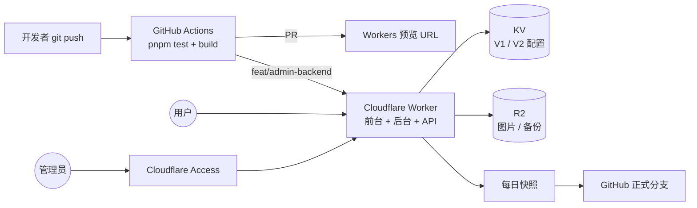

# 架构总览（当前实现）

> 文档随 `feat/admin-backend` 分支维护。当前正式版为 V2.1.0：Worker、前台、后台、KV 与 R2 已统一上线；正式版本与回滚基线见 [V2.1.0 归档](releases/V2.1.0.md)。Vite 重构历史见 [REFACTOR.md](REFACTOR.md)。

## 1. 技术栈与部署拓扑

| 层 | 选型 |
|----|------|
| 构建 | Vite 7（内容哈希产物 + `assetFileNames` 纯 hash 命名） |
| 前端 | Vue 3（Composition API + `<script setup>`）+ TypeScript + vue-router（hash 模式） |
| 包管理 | pnpm workspace（`apps/*`，为 `apps/admin` 预留） |
| 离线 | vite-plugin-pwa（autoUpdate） |
| 测试 | Vitest 单测 + Playwright 驱动的 E2E/PWA 验收脚本 |
| 部署 | **Cloudflare Workers：静态资源 + API**（主力）+ 独立静态版（规划中） |
| 数据 | Cloudflare KV（V1/V2 独立 Key）+ R2（地图图片和版本备份） |
| 后台鉴权 | Cloudflare Access + Worker JWT 二次校验 |
| CI | GitHub Actions：PR → 测试/构建/上传预览版本；push `feat/admin-backend` → 部署正式 Worker；`main` 不触发 Worker 部署 |


```mermaid
flowchart LR
  Dev[开发者 git push] --> CI[GitHub Actions<br>pnpm test + build]
  CI -->|PR| PV[Workers 预览 URL]
  CI -->|feat/admin-backend| CF[Cloudflare Worker<br>前台 + 后台 + API]
  CF --> KV[(KV<br>V1 / V2 配置)]
  CF --> R2[(R2<br>图片 / 备份)]
  Cron[每日快照] --> GH[GitHub 正式分支]
  CF --> Cron
  U((用户)) --> CF
  A((管理员)) --> Access[Cloudflare Access]
  Access --> CF
```

## 2. 目录结构（要点）

```text
idv-cryptic-map/
├── apps/web/                  # V1 兼容页 + V2 正式前台
│   ├── scripts/               # gen-thumbs（sharp 缩略图）/ subset-fonts（字体子集化）
│   │                          # verify-e2e（31 项验收）/ verify-pwa（离线 5 项）
│   ├── public/                # _headers（缓存头）、PWA 图标、图例 icons
│   └── src/
│       ├── data/maps.snapshot.json # V1 每日构建期快照
│       ├── data/maps-v2.ts    # V2 公开配置加载和筛选
│       ├── data/maps.ts       # V1 兼容数据访问层
│       ├── assets/maps/       # entry / entry-thumb(生成) / floor1 / floor2 / full，28×4 webp
│       ├── assets/fonts/      # 子集化 woff2 ×3（共约 529KB）
│       ├── views/ components/ composables/（useZoomPan 缩放拖拽核心）
│       └── router.ts          # 与旧站 hash 链接逐字符兼容
├── apps/admin/                # V1/V2 后台与裁剪工作台
├── packages/shared/           # V2 Schema、发布校验、公开序列化
├── workers/                   # Worker 入口、公开/后台 API、鉴权与每日快照
├── maps/                      # 原始素材（应急裁剪来源，不参与部署）
├── crop_images.py             # 裁图脚本（输出到 apps/web/src/assets/maps/）
├── wrangler.jsonc             # Workers 静态资源配置（SPA fallback）
├── vercel.json                # Vercel 镜像构建与缓存头
└── .github/workflows/deploy.yml
```

`site/` 旧站目录已于 2026-08-22 删除（新构建零引用；旧版在 main 分支与旧 Pages 项目保留）。

## 3. 数据流：V1/V2 隔离

```mermaid
flowchart LR
  Admin[后台编辑/裁剪] --> API[Worker 后台 API]
  API --> V1[(KV config:current)]
  API --> V2[(KV config:v2:current)]
  API --> R2[(R2 图片与备份)]
  V1 --> Public1[/maps.json]
  V2 --> Public2[/maps-v2.json]
  Public1 --> Web[V1 兼容前台]
  Public2 --> Web2[V2 正式前台]
  Public2 --> Static[main 静态版 / 微信小程序]
```

- V1 与 V2 使用不同 KV Key、备份目录和公开协议，V2 保存不会覆盖 V1。
- 后台配置内部只保存 R2 Key，公开接口根据请求域名生成完整图片 URL。
- 草稿允许逐步录入；发布时 Worker 强制校验模式、楼层和入口完整度。
- 前台读取失败时使用构建期快照兜底；图片使用内容稳定的 R2 Key 和长期缓存。

> 历史注记：重构初版曾实现「快速区域指引」（`rooms` 房间坐标 + 高亮聚焦），2026-07-16 经确认无实际使用价值已整体移除（`bf89f7a`），后续后台管理数据模型中也不保留该字段。

## 4. 缓存模型：「更新即生效」

| 资源 | Cache-Control | 说明 |
|------|---------------|------|
| `/`、`/index.html` | `no-cache, must-revalidate` | 体积几 KB，每次回源验证（ETag 304） |
| `sw.js` / `registerSW.js` / `manifest.webmanifest` | `no-cache, must-revalidate` | 保证 SW 及时更新 |
| `/assets/*`（JS/CSS/图片/字体） | `public, max-age=31536000, immutable` | 全部内容哈希命名，内容变 = 文件名变 |
| `/maps.json`、`/maps-v2.json` | `no-cache, must-revalidate` | ETag 按 dataVersion 验证，配置修改后刷新即可生效 |
| `/r2/maps/*` | `public, max-age=31536000, immutable` | 图片 Key 变化代表新内容，旧版本继续可回滚 |

原理：改图/改配置 → push → CI 构建（产物哈希变化）→ 部署 → 用户普通刷新时 HTML 回源拿到新哈希引用 → 只下载变化的文件，其余全部命中本地一年缓存。**无手动版本号，无需用户强刷。**

产物命名细节：统一纯 hash（源文件保持中文名，规避非 ASCII URL 兼容坑）；入口缩略图加 `t-` 前缀便于 PWA 按名 precache；`assetsInlineLimit: 0` 保证缓存粒度按文件独立。

## 5. PWA 策略

- `registerType: 'autoUpdate'`：后台发现新版自动激活，与「更新即生效」一致。
- precache 只放「壳子」（HTML/JS/CSS/字体/图标/入口缩略图）；约 13MB 的楼层/全图大图走 runtime CacheFirst（访问过才缓存），首访不强制全量下载。
- 逃生舱：SW 出严重问题时用 vite-plugin-pwa 的 `selfDestroying` 发一版自毁 SW，立即退回纯在线模式。

## 6. 字体

三款字体（Cinzel / Ma Shan Zheng / Noto Serif SC）子集化后自托管，无 Google Fonts 依赖（大陆可达）。子集字符表须覆盖 maps.json 全部文本——有单测守护，新增地图名出现缺字时 CI 会红，重跑 `scripts/subset-fonts.mjs` 即可。

## 7. 路由兼容（硬约束）

V2 使用稳定 ID 路由，V1 和旧分享链接继续兼容：

| 格式 | 含义 |
|------|------|
| `#/hard/side` | 正式默认困难侧门目录 |
| `#/nightmare/front/upperLeft` | 噩梦正门 + 通道类型筛选 |
| `#/nightmare/upstairs/map/<id>/basement` | 噩梦二楼门地图地下室 |
| `#/v1/*` | V1 规范路径 |
| `#/v2/*`、`#/legacy`、`#/dir/*`、`#/map/*` | 自动替换为对应 V2/V1 规范路径 |

未知地图、模式不支持的入口或错误筛选值会回到当前模式的安全目录，不影响页面加载。

## 8. 质量保障

| 手段 | 覆盖 |
|------|------|
| Vitest 36 项 | Shared V2 Schema/发布校验 10 + Web 数据/路由/字体 26 |
| `verify-e2e.mjs` 31 项 | Playwright 驱动本机 Chrome，含新旧站截图对照 |
| `verify-pwa.mjs` 5 项 | 离线可用性 |
| CI 硬门槛 | test + build 失败即阻断部署 |
